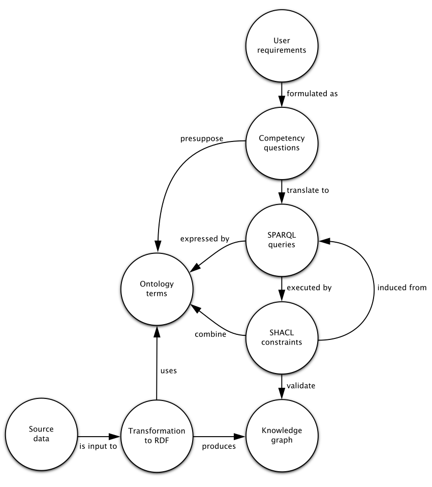

<!--
Alternative title: Using tests for knowledge graph construction
We can also make up a name for the proposed method.
-->

Knowledge graphs use graph-based data models to capture knowledge commonly combined from large and diverse data sources [@Hogan2021].
Constructing knowledge graphs can be an intricate and open-ended task that is in many ways an art rather than a craft.^[The same argument was made about designing ontologies in @Soldatova2016.]
We are short on solid engineering practices to guide us through it.

We propose how to construct knowledge graphs using a method based on user requirements formulated as competency questions.
It suggests to formalize the competency questions as SPARQL [@SPARQL2013] queries and wrap them as SHACL [@SHACL2017] constraints allowing them to be used as automated tests.
The method defines a process to guide a knowledge graph construction based on feedback from tests.
It aims to reduce the effort required to construct a knowledge graph that meets its requirements, while assessing the quality of semantic artifacts made in this effort.

Following a method for knowledge graph construction offers several benefits.
In general, a method helps decide what to do next.
In particular, it is useful in the beginning to overcome the blank canvas paralysis.
A method breaks down the effort required for knowledge graph construction into sub-tasks, which can help organize and coordinate a team working on them.

The direction provided by a method anchored in user requirements can reduce the undirected upfront effort and help avoid overengineering.
For example, it discourages needless effort spent on achieving a lossless transformation to the target knowledge graph that preserves all source data even though it might not be needed.
It can help avoid premature abstration and premature optimization, such as for performance or readability.
Thanks to the tests checking if the user requirements are satisfied, we get an early proof of value instead of speculating about it.

When outlining this method, we can learn from ontology engineering that has a head start of several decades on knowledge graphs.
There is a long tradition of using competency questions as requirements for ontologies [@Gruninger1994].
Much of this experience can be reused, since ontologies serve as essential building blocks of knowledge graphs imbuing them with explicit semantics.
Knowledge graphs in turn can be considered as ontologies populated with data.
Creating tests for ontologies out of competency questions is also nothing new [@Ren2014, @Zemmouchi2013] and more recently it was adopted for knowledge graphs too [@Pan2017].

Broader still, we can adopt the lessons learned in software engineering.
The hereby presented method borrows from the test-driven development cycle [@Beck2003], which is commonly characterized by the following steps:

- Add a test
- Run all tests, expecting the new test to fail
- Write the simplest code that passes the new test
- All tests should pass
- Refactor as needed

A fundamental feature of this cycle is that it intertwines development with testing, so that tests exercise the development artifacts provide and feedback informing further work.
Tests provide a controlled way how to evolve the artifacts under development in response to changing requirements.
Ontology engineering is already adopting similar agile development approaches using tests.
Ontology-specific methods, such as SAMOD [@Peroni2016] or Linked Open Terms [@PovedaVillalon2022], are being proposed.

The following text describes the proposed method for knowledge graph construction and demonstrates its use on a knowledge graph about antigen covid tests.

# Method

We present a method for test-driven knowledge graph construction.
The method proposes a sequence of steps and feedback loops between them. 
An overview of the relations between the key artifacts used by the method are depicted in [@fig:process].

{#fig:process}

First, start by using knowledge elicitation techniques [@Shadbolt2015] to gather user requirements.
User requirements can be gathered from subject-matter experts or prospective users of the knowledge graph.
Formulate the user requirements as competency questions (CQs) [@Gruninger1994].
CQs are analytical questions that the target knowledge graph is expected to answer.
In order to avoid misinterpretation, they can be reviewed with those who expressed the requirements. 

Analyze the CQs to extract terms and relations.
CQs can be analyzed using the linguistic notion of presupposition, which can be defined as *"a condition that must be met for a linguistic expression to have a denotation"* [@Ren2014].
View this way, CQs presuppose the terms with which they can be expressed.
The terms to extract from CQs are typically nouns or noun phrases that refer to entities from the knowledge graph's domain.
They can be considered as surface forms of these entities.
The terms can be identified manually or aided with tools, such as by part-of-speech tagging.
The relations to extract might be represented by verbs connecting the terms co-occurring in a CQ.
Pronouns may translate to joins between the relations. 
Moreover, CQs may have implicit prerequisites that can also translate to relations between entities.

Formalize the terms and relations in a minimum viable ontology using RDF Schema [@Brickley2014].
Terms typically map to classes (i.e. instances of `rdfs:Class`) and relations map to properties (i.e. instances of `rdf:Property`) or map indirectly to n-ary relations represented by classes.
Document the ontology with definitions sourced from and validated by subject-matter experts to create a shared understanding.
The ontology should make minimal ontological commitment, so avoid its upfront axiomatization, such as OWL restrictions.
The resulting ontology is an explicit and machine-readable conceptualization of the knowledge graph's domain.
Consequently, this step may reveal ambiguity in the CQs.
Ambiguous CQs cannot be formalized reliably since misinterpretations may occur.
In such cases, sources of ambiguity should be revised with subject-matter experts aiming to reformulate them in an unambiguous way.

Translate the CQs to SPARQL queries expressed by the ontology.
SPARQL queries make the CQs executable.
We expect a manual translation of the CQs to SPARQL queries.
Automated translation was attempted by others, such as in @EspinozaArias2022, but we consider it out of our scope here.
Start with hypothetical, syntactically valid SPARQL queries expressed by the ontology.
A CQ may translate to a SPARQL graph pattern composed of triple patterns joining the terms co-occurring in the question via specific relations.
The way a CQ should be translated to a SPARQL query largely depends on its expected answer.
@Ren2014 suggests that we might be *"more interested in checking if a CQ can be meaningfully answered, instead of directly answering a CQ."*
When using such existential quantification, a SPARQL query formalizing a CQ can be expected to return non-empty results.
What it means is that the query can answer the CQ using the given knowledge graph.
It does not verify if the answer is correct.
Conversely, some CQs may describe universal invariants of their domain.
Constraints encoding these invariants are akin to property-based testing [@Fink1997].
In case stricter guarantees are needed, the expected correct answers can be included in the validation constraints implementing the CQs.
Such constraints correspond to the usual example-based testing.

Wrap the queries as SPARQL-based SHACL constraints to automate their execution.
SHACL defines a target^[<https://www.w3.org/TR/shacl/#targets>] of each constraint.
A target defines the scope of a CQ.
Scope of the data graph validated by the constraints may either encompass the entire knowledge graph, such as when it is small, or cover its subset.
For instance, queries checking the complete data graph can target it by using `sh:targetNode [] .`.
It is also possible to rewrite a part of a SPARQL query translating a CQ as target selection.
For example, a prerequisite part of the query can be represented as a SPARQL-based target [@SHACLAF2017].
An entity-centric partitioning can be implemented by defining a SPARQL-based target that covers a concise bounded description [@Stickler2005].
Some data sources for the knowledge graph may natively partition data in independent subsets, such as API responses or messages, that can be effectively validated by specific subsets of SHACL constraints.
SHACL also defines the criteria of correctness of the SPARQL queries.
An `sh:ask` query is expected to return the boolean `true`, while any results produced by an `sh:select` query are treated as violations.
Specific expected results can be either hard-coded into the queries or specified via `sh:hasValue` in case a single value is expected.

Develop a transformation of the source data to the target knowledge graph that is expected to meet the constraints.
This can be implemented in many ways, largely dependent on the source data, see e.g., @Fensel2020b, so we will not cover it here.

Validate the knowledge graph under development with the SHACL constraints.
If the validation fails, resolve the reported violations by fixing the artifacts created in the previous steps.
Fix the most primary artifact causing the violations.
For instance, data transformation shall not work around an insufficiently expressive ontology.
Imposing a more expressive data model on the knowledge graph might reveal errors in its source data.
In this way, finer structure of its ontology makes the previously hidden data quality issues visible.
Some feedback may even indicate ill-formed CQs in need of revision.

If the validation succeeds, refactor the artifacts.
Note that the above-described method tests if a knowledge graph meets the given user requirements.
It does not evaluate how well these requirements are satisfied.
Absence of errors does not imply that the knowledge graph is sound.
Therefore, the functional user requirements can be complemented by non-functional requirements.
These requirements can be checked and refactored by using alternative sources of feedback, such as:

Code review

: Elicit expert insight from ontology and data engineers.

User feedback

: The results produced by SPARQL queries formalizing the CQs can be judged incorrect by users.
  User feedback can identify incorrect interpretation of CQs or incorrect assumptions.
  It might prompt revisiting any of the setup steps or lead to adding more CQs.

Usability

: Usability may manifest as developer experience of writing SPARQL queries for the knowledge graph.
  In particular, complexity and verbosity of SPARQL queries may be considered.
  Usability of the queries reflects the usability of the ontology.
  For example, verbosity may be caused by duplicate data that can be abstracted to the ontology, while complexity can be reduced by introducing ontological shortcuts.
  Verbose SPARQL queries may suggest a need for introducing abstraction or additional axioms into the ontology. 
  In fact, some CQs can be answered directly using the knowledge formalized in the ontology, since SHACL expects the validated data graph^[<https://www.w3.org/TR/shacl/#data-graph>] to include the ontologies it populates. 

Performance

: Performance can be evaluated indirectly using the execution time of the SHACL validation.
  This time is proportional to the execution times of the SPARQL queries the constraints include.

SHACL constraints can serve as a formal specification of the anticipated use of the ontology.
Moreover, SHACL can transcend a single ontology and specify how to combine terms reused from multiple ontologies.
This can be leveraged in a common refactoring step that induces SHACL core constraints from the SPARQL queries to document how is the ontology expected to be used.
You can infer universally quantified axioms represented as SHACL constraints from a sample of existentially quantified axioms represented as SPARQL queries.
In particular, SHACL can represent the expected relations in data.
For example, more complex or distant relations might require the expressivity of SHACL to be represented, using property paths or SPARQL graph patterns. 
While SHACL does not support conditional constraints, they can be rewritted according to the inference rule of material implication ${\displaystyle P\to Q\Leftrightarrow \neg P\lor Q}$.

Using the above-mentioned feedback is a balancing act of multi-objective optimization.
For example, performance feedback may be incompatible with the feedback about verbosity.
CQs may pose conflicting requirements.
Addressing the feedback thus requires making informed trade-offs. 

As can be expected, the proposed method has several limitations.
Here we recount some of them, suggesting how to remedy them.
The method may cause the developed artifacts to overfit the user requirements in scope, which would hinder the reuse of the artifacts.
This shortcoming can be remedied by including more CQs or focusing on reusability during refactoring. 
User requirements for the knowledge graph under construction can be more complex than what SPARQL can express.
One way around it is formalizing the requirements in a more expressive programming language that extends SHACL, such as @SHACLJS2017.
Ultimately, in order to ameliorate the limitations of this method, it is best combined with other methods, such as those for ontology design.

# Case study: Antigen covid test knowledge graph

We used the described method to create a knowledge graph about antigen tests for SARS-CoV-2.
Its source data was originally gathered from regulatory bodies for medical devices to perform statistical analyses of diagnostic performance of the antigen tests [@Kliegr2022].
The source data includes evaluations of diagnostic performance of antigen covid tests, such as diagnostic sensitivity and specificity, that comes from several regulatory bodies from various countries and covers evaluations both from the tests' manufacturers and independent research institutes.
The data was integrated into a XML file for the purposes of the afore-mentioned analyses.
We set to create a knowledge graph out of this data to open it to a wider reuse.

We started by capturing user requirements formulated as competency questions, such as *"What is the sensitivity of given tests according to their manufacturers?"*.
We analysed the questions and extracted terms and relations, such as *"sensitivity"*, *"test"*, or *"has manufacturer"* in the question given as an example.

```ttl
:DiagnosticSensitivity a rdfs:Class ;
  rdfs:label "Diagnostic sensitivity"@en .
  
:AntigenCovidTest a rdfs:Class ;
  rdfs:label "Antigen covid test"@en .

:hasManufacturer a rdf:Property ;
  rdfs:label "Has manufacturer"@en .

:hasTest a rdf:Property ;
  rdfs:label "Has test"@en .

:hasAuthor a rdf:Property ;
  rdfs:label "Has author"@en .

:hasValue a rdf:Property ;
  rdfs:label "Has value"@en .
```

We followed the convention of prefixing the pre-bound SPARQL variables with `$`:

```rq
ASK {
  $test a :AntigenCovidTest ;
    :hasManufacturer ?manufacturer .

  [] a :DiagnosticSensitivity ;
    :hasTest $test ;
    :hasAuthor ?manufacturer ;
    :hasValue ?sensitivity .
}
```

Ultimately, we translated this competency question into the following SPARQL ASK query:

```rq
ASK {
  $test a act:AntigenCovidTest ;
    schema:manufacturer ?manufacturer .

  [] a ncit:C41394 ;
    dcterms:subject $test ;
    dcterms:creator ?manufacturer ;
    rdf:value ?sensitivity .
}
```

We transformed the input XML data to RDF/XML via an XSL transformation followed by SPARQL Update operations for post-processing.
We automated the data processing and test execution by a script based on Jena command-line tools.^[<https://jena.apache.org/documentation/tools>]

All artifacts we developed in this effort, such as competency questions, are available as open source.^[<https://github.com/jindrichmynarz/antigen-covid-tests-knowledge-graph>]

<!--
Compare the usability of XQueries on the source data with SPARQL queries on the resulting data?
- How could we do it? Show some examples implementing the same competency questions in XQuery and SPARQL?
-->

# Conclusions

# References
